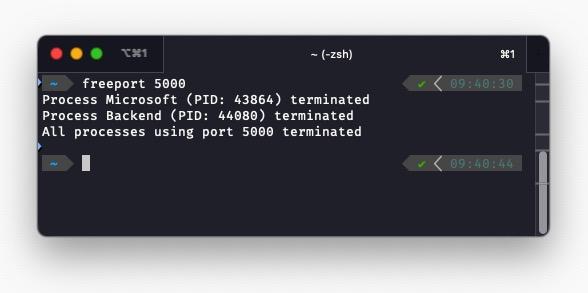

# Freeport

A simple CLI tool to kill the processes that are using a specific port.



## Intention

Have you often encountered the following error message when you try to start a server on a specific port? This happens a lot to a web developer when a dev server died unexpectedly and the port is still in use.

```javascript
Error: listen EADDRINUSE: address already in use 127.0.0.1:5000
    at Server.setupListenHandle [as _listen2] (node:net:1372:16)
    at listenInCluster (node:net:1420:12)
    at GetAddrInfoReqWrap.doListen (node:net:1559:7)
    at GetAddrInfoReqWrap.onlookup [as oncomplete] (node:dns:73:8) {
  code: 'EADDRINUSE',
  errno: -4091,
  syscall: 'listen',
  address: '127.0.0.1',
  port: 5000
}
```

There are simple scripts to solve this problem, typically by using `lsof -i :<port>` and `kill` commands on macOS or Linux. And use `netstat -aon` and `taskkill` commands on Windows. But if you can never remember the commands or you are just too lazy to type them, this tool is for you.

It kills the process that is using a specific port. It's a simple tool that is easy to use.

```bash
freeport <port>
```

## Installation

### Mac - homebrew

The package is not available in the official Homebrew repository yet, but you can install it from the tap:

```bash
brew tap ccc159/freeport https://github.com/ccc159/freeport.git
brew install freeport
```

### Windows - powershell

In the future, we can add the package to Chocolatey repository if there is a need. For now, you can install it using the following PowerShell script:

1. Open PowerShell as an administrator.
2. Run the following command:

```powershell
powershell -Command "Invoke-WebRequest -Uri 'https://raw.githubusercontent.com/ccc159/freeport/main/install-freeport.ps1' -OutFile '$env:TEMP\install-freeport.ps1'; & '$env:TEMP\install-freeport.ps1'"
```

### Linux - apt

It's not handled yet. But we do have a local build script that you can use to build the project locally. See the [Build locally](#build-locally) section.

### Build locally

If you want to build the project locally, you can run the following commands:

```bash
git clone https://github.com/ccc159/freeport.git
cd freeport
chmod +x build_local.sh
./build_local.sh
```

Then you'll find the binary in the `build` folder.

## Usage

There are only two commands available:

1. main command: `freeport <port>`
2. check version: `freeport --version`
